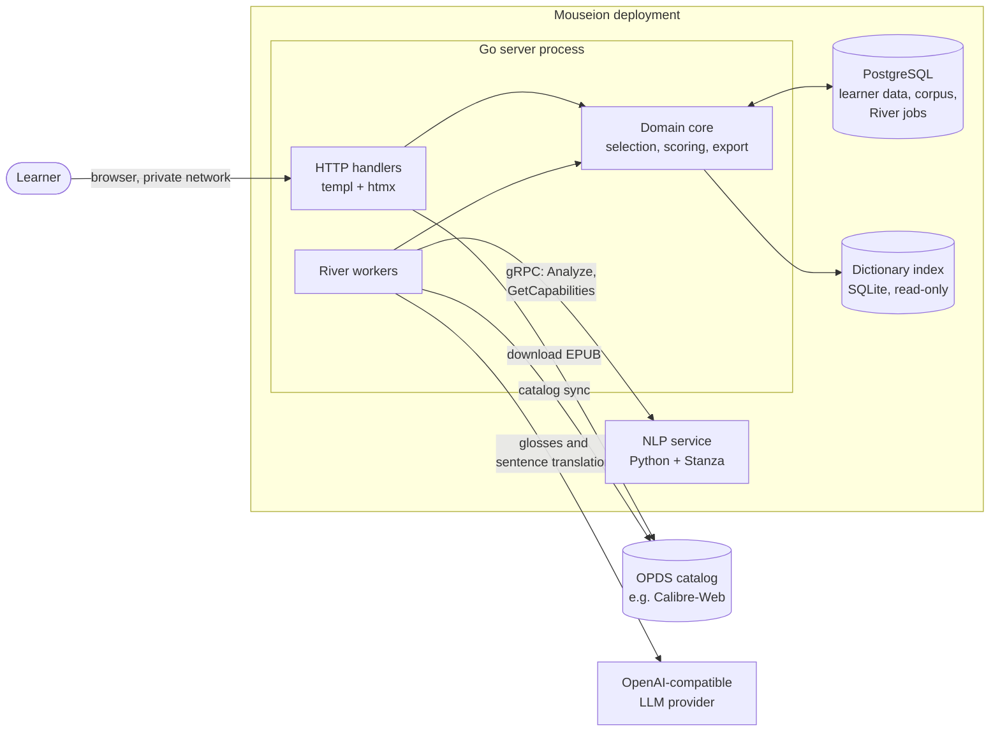
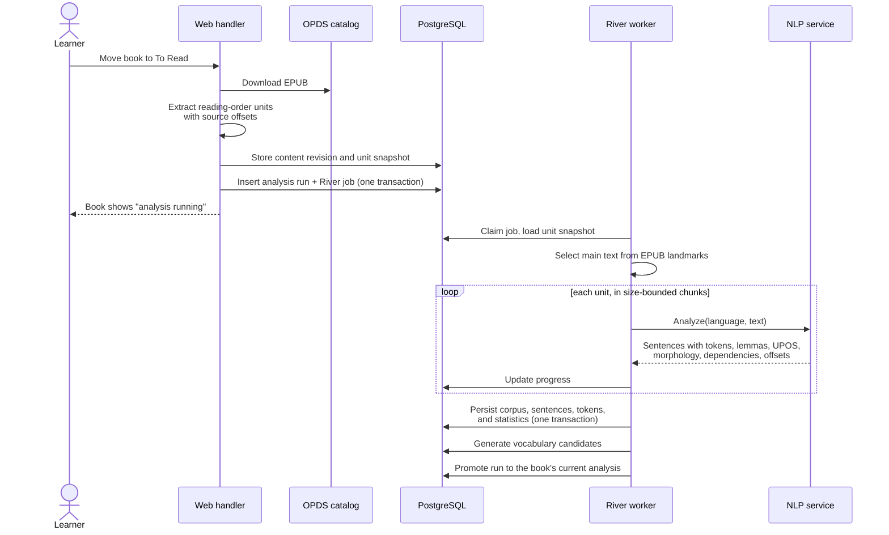
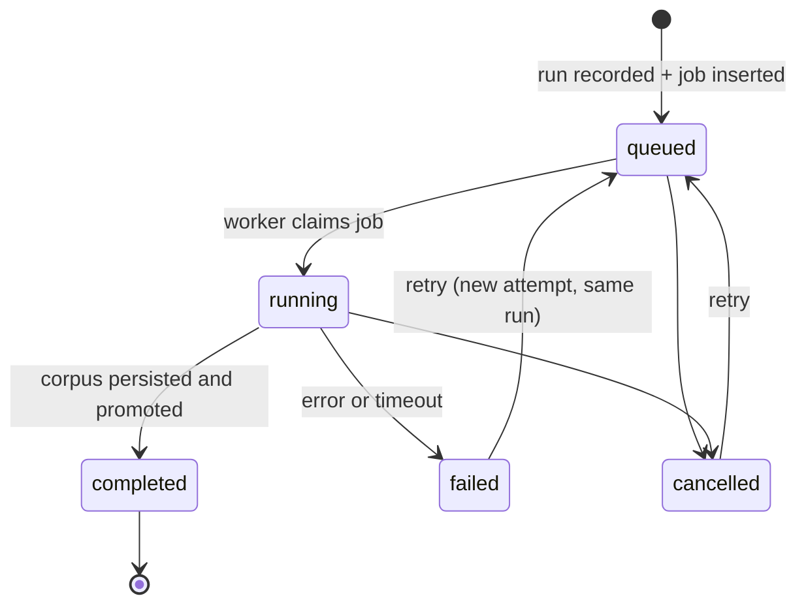
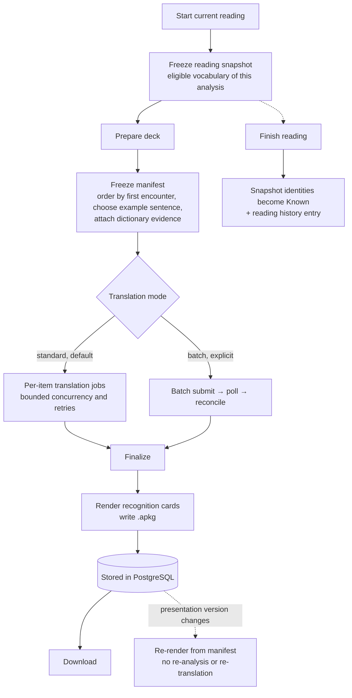
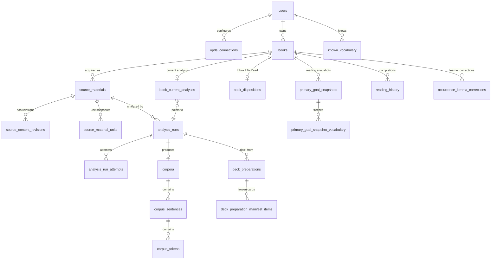
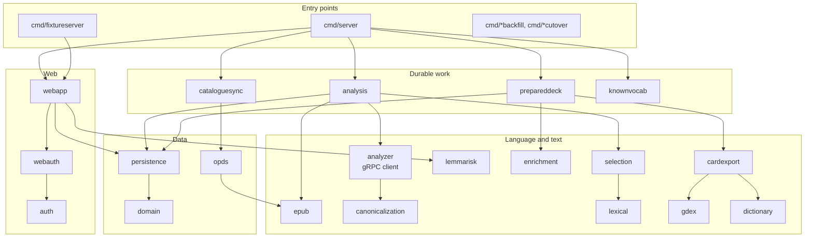

# Architecture

This document describes how Mouseion is built: its processes, how a book
becomes an analyzed corpus and then an Anki deck, how data is owned and stored,
and where each responsibility lives in the code. It describes the system as it
is. The reasons behind each decision are in the
[architecture decision records](doc/adr/), linked throughout, and the
linguistic design is covered in the [linguistic design notes](doc/linguistics.md).

## Principles

A few rules shape most of the design:

- **Product logic lives in Go; Python only does NLP.** The Python service
  turns text into annotated sentences and nothing else. Vocabulary identity,
  selection, scoring, and export are Go code that can be tested without models
  ([ADR 0001](doc/adr/0001-go-core-python-nlp-service.md)).
- **Analysis output is immutable.** A completed analysis is never edited.
  Learner corrections, newer analyses, and changed presentation are layered on
  top or recorded as new runs, so every deck can be traced to the exact text
  and analyzer version it came from
  ([ADR 0028](doc/adr/0028-explicit-scoped-analysis-lifecycle.md),
  [ADR 0081](doc/adr/0081-learner-owned-occurrence-lemma-corrections.md)).
- **Ownership is enforced by the database.** Learner-owned tables key on
  `owner_id`, and references between them are composite `(owner_id, …)`
  foreign keys, so a row cannot point at another learner's data even if
  application code is wrong
  ([ADR 0002](doc/adr/0002-multi-user-accounts.md)).
- **Long work is durable.** Analysis, catalog sync, and deck preparation run as
  [River](https://riverqueue.com/) jobs in PostgreSQL. Jobs are inserted in the
  same transaction as the state they act on, survive restarts, and record
  progress in ordinary tables
  ([ADR 0010](doc/adr/0010-river-job-queue.md)).
- **The NLP service decides what is possible.** Languages and features are
  discovered from the running service, not configured in the web application
  ([ADR 0023](doc/adr/0023-nlp-capabilities.md)).
- **The interface is server-rendered.** Pages are HTML from Go templates,
  enhanced with htmx; core workflows also work without JavaScript
  ([ADR 0083](doc/adr/0083-concordance-server-rendering-and-htmx-4.md)).

## System overview

| Process | Responsibility |
| --- | --- |
| Go server ([`cmd/server`](cmd/server)) | HTTP interface, authentication, domain logic, and River workers in one binary. Applies database migrations at startup. |
| NLP service ([`nlp/`](nlp/src/mouseion_nlp)) | Long-lived gRPC server that keeps Stanza pipelines warm and returns tokenized, tagged, lemmatized, and parsed sentences. A one-shot provisioner downloads models into a volume ([ADR 0063](doc/adr/0063-stanza-models-on-volume.md)). |
| PostgreSQL | All learner state, the analyzed corpus, stored Anki packages, and the River job tables. |
| Dictionary index | Optional SQLite file derived at build time from Wiktionary data and mounted read-only ([ADR 0064](doc/adr/0064-dictionary-enrichment-provider.md)). |

The Go↔Python boundary is a single versioned Protobuf contract,
[`proto/mouseion/v1/normalized_corpus.proto`](proto/mouseion/v1/normalized_corpus.proto),
with two calls: `Analyze` and `GetCapabilities`
([ADR 0011](doc/adr/0011-grpc-go-python-transport.md)).

## From book to corpus

When a learner moves a book to *To Read*, the web request acquires the EPUB and
records an analysis run; a River worker does the analysis.

- **Extraction** ([`internal/epub`](internal/epub)) walks the EPUB spine,
  skips non-linear and navigation documents, and keeps each unit's text,
  title, landmarks, and character offsets. The snapshot is immutable; a new
  catalog revision gets a new snapshot.
- **Main-text selection** uses declared EPUB 3 landmarks to drop front and back
  matter, falling back to the whole book when the structure is ambiguous
  ([ADR 0066](doc/adr/0066-main-text-selection-from-epub-structure.md)).
- **Chunking** keeps each gRPC request bounded and shifts offsets so every token
  still points at its exact place in the source
  ([ADR 0013](doc/adr/0013-size-based-nlp-chunking.md)).
- **The normalized corpus** (`corpus_sentences`, `corpus_tokens`) stores every
  token's surface form, raw and canonical lemma, UPOS, morphology, dependency
  relation and head, and source offsets. Coverage metrics, the concordance,
  sentence scoring, and lemma review all read this data instead of calling the
  NLP service again
  ([ADR 0059](doc/adr/0059-persisted-normalized-corpus-for-concordance.md),
  [ADR 0060](doc/adr/0060-persist-dependency-parses.md)).
- **Promotion** points the book at its newest completed analysis. Earlier runs
  stay as history.

### Analysis run lifecycle

A run's identity and status URL stay stable across retries; each attempt is
recorded separately in `analysis_run_attempts`. Cancellation commits in the
database before the River job is cleaned up, so a late-finishing worker cannot
resurrect a cancelled run.

## From corpus to deck

- **Selection** ([`internal/selection`](internal/selection)) keeps content
  words (NOUN, VERB, ADJ, ADV) that occur at least three times in the book, or
  exactly twice when they occur at least ten times across the learner's
  analyzed books. It excludes Known and Reserved vocabulary
  ([ADR 0048](doc/adr/0048-frequency-floor-deck-selection.md),
  [ADR 0085](doc/adr/0085-reading-owned-book-vocabulary.md)).
- **The reading snapshot** freezes that vocabulary when reading starts, so
  later corrections or imports cannot silently change a deck in progress.
  Finishing the book moves the snapshot into Known vocabulary; generating cards
  never does ([ADR 0078](doc/adr/0078-book-dispositions-and-current-reading.md)).
- **The manifest** ([`internal/prepareddeck`](internal/prepareddeck)) records
  every decision before any external call: card order, the chosen sentence
  and its quality score, omissions, and cache identities. Translation work is
  then a set of short, resumable jobs, and finalization is idempotent
  ([ADR 0030](doc/adr/0030-durable-prepared-deck-translation.md),
  [ADR 0032](doc/adr/0032-standard-first-prepared-deck-translation.md)).
- **Rendering** ([`internal/cardexport`](internal/cardexport)) writes the Anki
  package with a pure-Go SQLite driver. Because the manifest is independent of
  presentation, a card-design change regenerates ready decks without
  re-analysis or re-translation
  ([ADR 0071](doc/adr/0071-decouple-deck-data-from-presentation.md)).

## Background jobs

All background work runs in River inside the Go server process, on named
queues so a long analysis never blocks catalog sync or deck work.

| Queue | Job kinds | Work |
| --- | --- | --- |
| `analysis` | `analyze_corpus`, `rebuild_vocabulary_browse_counts` | Book analysis; cross-book vocabulary count projections |
| `catalogue_sync` | `catalogue_sync` (periodic per connection), `book_cover` | Metadata-only catalog reconciliation and cover retrieval ([ADR 0041](doc/adr/0041-catalog-sync-metadata-first.md)) |
| `known_vocabulary` | `import_known_vocabulary` | Lemma-list imports |
| `prepared_decks` | `prepared_deck`, `prepared_deck_finalize`, `prepared_deck_rerender`, `prepared_deck_reconcile`, `prepared_deck_batch_submit`, `prepared_deck_batch_poll`, `prepared_deck_batch_cleanup` | Deck coordination, finalization, recovery, and Batch lifecycle |
| `prepared_deck_translation` | `prepared_deck_translation` | Standard per-item translation, with configurable concurrency |

Jobs are idempotent: each records its outcome in ordinary tables, so a retry
after a crash resumes from persisted state rather than repeating finished work.

## Data model

The core entities and their relationships. Every table except the shared
reference data (`normalized_corpus_artifacts`, `shared_lemmas`,
`supported_languages`, `enrichment_cache`) is owned by a user.

Notes on naming: `primary_goal_snapshots` stores the current-reading vocabulary
snapshot (the table predates the current *Reading* terminology), and
`source_materials` is an acquired EPUB, as distinct from the catalog-level
`books` entry. Vocabulary identity throughout is
`(language, canonical_lemma, upos)`.

The schema starts from a single baseline migration with numbered successors
([ADR 0070](doc/adr/0070-migration-and-documentation-reboot.md)); schema
changes follow [ADR 0038](doc/adr/0038-schema-change-governance.md).
Queries are hand-written SQL through `pgx`, with
[sqlc](https://sqlc.dev/)-generated code in [`gen/sqlc`](gen/sqlc).

## Code map

| Package | Responsibility |
| --- | --- |
| [`domain`](internal/domain) | Core corpus, book, and vocabulary models |
| [`persistence`](internal/persistence) | PostgreSQL repositories with explicit ownership boundaries |
| [`epub`](internal/epub) | Reading-order extraction with reproducible source locations; main-text selection |
| [`analyzer`](internal/analyzer) | The project-owned analysis boundary and its gRPC client |
| [`analysis`](internal/analysis) | Durable analysis jobs: chunking, persistence, promotion |
| [`canonicalization`](internal/canonicalization) | Language-specific canonical lemma profiles |
| [`lexical`](internal/lexical), [`selection`](internal/selection) | Eligibility rules and deterministic vocabulary candidates |
| [`analysisinsights`](internal/analysisinsights) | Coverage and threshold metrics for a learner and a book |
| [`lemmarisk`](internal/lemmarisk) | Conservative detection of occurrences that merit learner review |
| [`gdex`](internal/gdex) | GDEX-informed example-sentence scoring |
| [`dictionary`](internal/dictionary) | Read-only access to the Wiktionary-derived index |
| [`enrichment`](internal/enrichment) | Dictionary and LLM enrichment, caching, and the external-provider privacy boundary |
| [`prepareddeck`](internal/prepareddeck) | Durable deck preparation: manifest, translation, finalization |
| [`cardexport`](internal/cardexport) | Recognition-card rendering and `.apkg` packaging |
| [`opds`](internal/opds), [`cataloguesync`](internal/cataloguesync), [`bookcover`](internal/bookcover) | OPDS client, metadata sync, and cover retrieval |
| [`knownvocab`](internal/knownvocab) | Known-vocabulary list imports |
| [`auth`](internal/auth), [`webauth`](internal/webauth) | Local accounts, Argon2id passwords, sessions |
| [`webapp`](internal/webapp) | Handlers, templ views, styles, and static assets |
| [`fixtures`](internal/fixtures) | In-memory data for the browser acceptance suite |

The Python side is small: [`producer.py`](nlp/src/mouseion_nlp/producer.py)
maps Stanza output to the Protobuf contract and applies the producer-side
normalization, [`server.py`](nlp/src/mouseion_nlp/server.py) serves gRPC,
[`model_config.py`](nlp/src/mouseion_nlp/model_config.py) selects models per
language, and [`provision.py`](nlp/src/mouseion_nlp/provision.py) downloads
them.

## Testing

| Layer | How it is tested |
| --- | --- |
| Domain and language logic | Go unit tests, including a shared parity fixture that keeps German normalization identical in the Go runtime and the Python dictionary-index builder |
| Persistence and jobs | Integration tests against real PostgreSQL via Testcontainers; each test gets its own database cloned from a migrated template |
| NLP producer | pytest with fake pipelines, plus a reproducible precision measurement against real Stanza models ([evidence](doc/evidence/german-separable-verb-precision.md)) |
| Interface | Playwright against [`cmd/fixtureserver`](cmd/fixtureserver), an in-memory server with no database or NLP, in Chromium and WebKit, desktop and compact, light and dark ([ADR 0033](doc/adr/0033-browser-acceptance-harness.md)) |

See the [development guide](doc/development.md) for commands.
