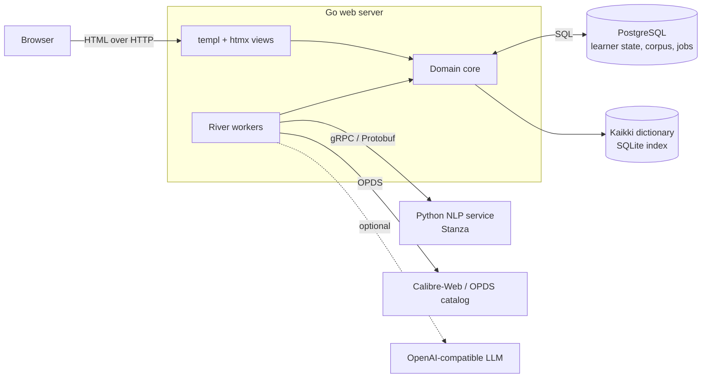

# Mouseion

**A self-hosted reading environment for learning a foreign language through the
books you actually want to read.**

Mouseion connects to a personal ebook library, analyzes each book
linguistically, tells a learner how much of its vocabulary they already know,
and prepares the words worth learning, each with an example sentence from the
book itself, as an Anki deck. It supports German, Italian, and Modern Greek.

The name recalls the Mouseion of Alexandria, the scholarly community that housed
the Library.

## Why

Reading literature in a foreign language becomes comfortable at roughly 95–98%
coverage of a text's running words. Below that, a learner either stops to look
words up constantly or reads graded material instead of the books they care
about. Generic frequency lists don't close that gap for a *specific* book, and
generic flashcard sentences say little about how a word is used in the text
being read.

Mouseion treats each book as a small corpus. It lemmatizes and parses the text,
measures coverage against the learner's known vocabulary, and selects the
recurring unknown lemmas that most improve coverage. It then builds recognition
cards from the book's own sentences, so studying a word means meeting it in the
context where it will be read.

## What it does

1. **Catalog sync.** Connects to a learner-owned [OPDS](https://opds.io/)
   catalog (for example Calibre-Web) and syncs book metadata into *My Books*.
   Catalog credentials are encrypted at rest.
2. **Reading intent.** Moving a book to *To Read* acquires its EPUB and queues
   one durable analysis.
3. **Analysis.** Selects the book's main text, lemmatizes, tags, and parses it
   with [Stanza](https://stanfordnlp.github.io/stanza/), and persists the
   normalized sentence and token stream with dependency relations.
4. **Evidence.** Reports coverage of running words and the vocabulary needed to
   reach 95%, 97%, and 99%. Learners can review and correct suspicious lemmas
   before vocabulary is frozen.
5. **Concordance.** A keyword-in-context view of every occurrence of a lemma
   across the learner's analyzed books, with full-sentence study.
6. **Deck preparation.** Selects eligible unknown lemmas and the best example
   sentence for each, adds dictionary morphology and a contextual English gloss,
   and builds an Anki package named `Mouseion::<language>::<book title>`.
7. **Reading progress.** Starting a book reserves its vocabulary; finishing it
   moves that vocabulary into the learner's modeled known set. Generating
   cards never marks a word as known
   ([ADR 0036](doc/adr/0036-primary-goal-justified-graduation.md)).

## Language and text processing

The language-specific work lives in a Go core
([`internal/canonicalization`](internal/canonicalization),
[`internal/lexical`](internal/lexical),
[`internal/gdex`](internal/gdex)) and a Python NLP producer
([`nlp/`](nlp/src/mouseion_nlp)). Each behavior is specified in a feature
document and decided in an ADR:

- **Main-text selection.** EPUB 3 landmark declarations identify body matter
  and exclude front matter, bibliographies, indexes, and colophons from
  analysis. Notes and appendices are kept on purpose, and the selector falls
  back to the whole book rather than guessing
  ([spec](doc/features/main-text-selection.md),
  [ADR 0066](doc/adr/0066-main-text-selection-from-epub-structure.md)).
- **German separable verbs.** Detached particles are reattached to their verbs
  from dependency data, so *fängt … an* is counted as *anfangen*. A closed list
  of separable prefixes guards the reattachment, and its precision is
  [measured on Goethe's *Werther*](doc/evidence/german-separable-verb-precision.md)
  ([spec](doc/features/separable-verb-lemmatization.md),
  [ADR 0061](doc/adr/0061-german-separable-verb-lemmatization.md)).
- **Historical orthography.** Documented pre-1996 German ß spellings
  (*daß* → *dass*) map to their reformed lemmas without merging distinct lexemes
  ([ADR 0065](doc/adr/0065-german-pre-1996-sharp-s-canonicalization.md)).
- **Modern Greek.** The Greek Dependency Treebank models with a Greek-BERT
  parser, final-sigma canonicalization, expansion of contractions such as
  *στο*/*στην*, and noun gender
  ([research](doc/research/modern-greek-nlp.md),
  [ADR 0073](doc/adr/0073-modern-greek-language-support.md)).
- **Example-sentence quality.** A deterministic rubric informed by
  [GDEX](https://github.com/zentrum-lexikographie/gdex) runs over the persisted
  parses. It rejects fragments without a finite verb and subject, then ranks
  candidates by clause position, deixis, named-entity density, and length
  ([spec](doc/features/sentence-quality-scoring.md),
  [ADR 0062](doc/adr/0062-derived-sentence-quality-scoring.md)).
- **Persisted corpus.** Analysis output is immutable, so concordance and
  grammar-aware queries never re-run NLP
  ([spec](doc/features/concordance-foundation.md),
  [ADR 0059](doc/adr/0059-persisted-normalized-corpus-for-concordance.md),
  [ADR 0060](doc/adr/0060-persist-dependency-parses.md)).
- **Dictionary evidence with provenance.** Glosses, gender, plurals, IPA, and
  principal parts come from a Wiktionary-derived
  [Kaikki](https://kaikki.org/) index. The index records its dump date,
  extractor commit, and license. LLM glosses are grounded in that evidence and
  the source sentence
  ([spec](doc/features/dictionary-gloss-enrichment.md),
  [ADR 0079](doc/adr/0079-contextual-glosses-require-llm.md)).
- **Learner corrections.** Corrections to analyzer lemmas are stored as an
  owner-scoped layer over the immutable analysis rather than edits to it
  ([spec](doc/features/lemma-review-and-correction.md),
  [ADR 0081](doc/adr/0081-learner-owned-occurrence-lemma-corrections.md)).

## Architecture



- **Go core** owns the product logic: domain model, persistence, vocabulary
  selection, sentence scoring, and Anki export. Python is used only where the
  NLP libraries require it
  ([ADR 0001](doc/adr/0001-go-core-python-nlp-service.md)).
- **Python NLP service** is a long-lived Stanza producer behind a versioned
  Protobuf contract ([`proto/`](proto/),
  [ADR 0011](doc/adr/0011-grpc-go-python-transport.md)). It also decides which
  languages are available ([ADR 0023](doc/adr/0023-nlp-capabilities.md)).
- **PostgreSQL** stores per-learner state, the normalized corpus, and the
  [River](https://riverqueue.com/) job queue, which runs analysis, enrichment,
  catalog sync, and deck preparation without a separate broker
  ([ADR 0010](doc/adr/0010-river-job-queue.md)).
- **Web interface** is server-rendered with [templ](https://templ.guide/) and
  enhanced with [htmx](https://htmx.org/). Core workflows also work without
  JavaScript.

## Engineering practices

- **86 architecture decision records**, indexed with their current status in
  [`doc/product.md`](doc/product.md#architecture-decision-records). Superseded
  decisions are kept and linked to the decisions that replaced them.
- **A domain glossary** ([`CONTEXT.md`](CONTEXT.md)) used consistently in code,
  interface, and documentation.
- **Tests at every boundary.** Go unit tests; PostgreSQL integration tests on
  per-test cloned databases with Testcontainers; pytest for the NLP producer;
  and a Playwright suite over a deterministic in-memory server, run in Chromium
  and WebKit across desktop and compact viewports in light and dark schemes.
- **Generated code checked in CI.** Protobuf and [sqlc](https://sqlc.dev/)
  output and the compiled stylesheet are regenerated in CI and must match the
  committed files. Toolchains and dependencies are pinned.
- **Schema governance.** An immutable baseline migration, with explicit review
  for consequential schema changes
  ([ADR 0038](doc/adr/0038-schema-change-governance.md),
  [ADR 0070](doc/adr/0070-migration-and-documentation-reboot.md)).

## How this project is built

Mouseion is also an experiment in agent-driven software development, and
part of its purpose was to learn how to do that well. I own the product
direction, the domain model, and the architecture decisions. Coding agents
implement against them through issues and pull requests, under the same gates
as any contributor:

- Accepted ADRs and feature documents set the scope for each change, and
  [`CONTEXT.md`](CONTEXT.md) fixes the vocabulary.
- Every change goes through a pull request with required CI checks.
- `CODEOWNERS` requires human review for anything touching security, data
  integrity, build trust, or deployment: workflows, migrations, authentication,
  dependency manifests, and containers
  ([autonomous change policy](doc/autonomous-change-policy.md)).
- Agent-facing conventions are kept in the repository
  ([`AGENTS.md`](AGENTS.md), [`doc/agents/`](doc/agents/)).

Many commits are therefore authored by an agent account. The decision records
and their revision history show how the design evolved and why.

## Getting started

Mouseion runs as three processes: PostgreSQL, the NLP service, and the web
server. The quickest path is Docker Compose:

```sh
cp .env.example .env   # set a strong MOUSEION_DB_PASSWORD and MOUSEION_SECRET
docker compose up -d --build
```

Then open `http://localhost:8080`. A fresh installation creates the first
account at sign-in. The first start downloads the Stanza models for German,
Italian, and Greek into a Docker volume.

- [Operations guide](doc/operations.md): configuration, language models, the
  dictionary index, and maintenance.
- [Development guide](doc/development.md): toolchain, tests, generated code, and
  conventions.
- [Documentation index](doc/README.md): where to start reading.

## Status

Mouseion is a personal project in active use. It is built for a small,
trusted, self-hosted deployment reachable only over a private network such as
a Tailscale tailnet ([ADR 0009](doc/adr/0009-home-lab-auth-corpus-isolation.md)).
It is not hardened for public internet exposure; see [SECURITY.md](SECURITY.md).
German, Italian, and Modern Greek are the supported analysis languages.

## License

Copyright © 2026 Justin Hayes.

Mouseion is free software: you can redistribute it and/or modify it under the
terms of the [GNU Affero General Public License, version 3](LICENSE)
(`AGPL-3.0-only`). If you run a modified version as a network service, the AGPL
requires you to offer its users the corresponding source.

Bundled third-party assets keep their own licenses, recorded beside them in
[`internal/webapp/static/vendor/`](internal/webapp/static/vendor/) (htmx under
0BSD; Tailwind CSS and daisyUI under MIT; Literata and Commissioner under the SIL
Open Font License). The optional dictionary index is not distributed with the
source; when built, it is Wiktionary-derived data under CC BY-SA 3.0 / GFDL, as
described in the [operations guide](doc/operations.md#dictionary-index).
